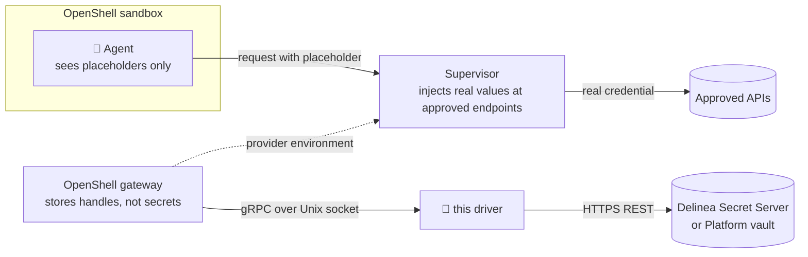

<div align="center">

# 🔐 openshell-secret-server-driver

**Your agents' credentials live in Delinea Secret Server.<br/>OpenShell hands them out only where policy says so.**

A credential driver that plugs [Delinea Secret Server](https://delinea.com/products/secret-server)
(and the vault behind a [Delinea Platform](https://delinea.com/products) tenant) into
[NVIDIA OpenShell](https://github.com/NVIDIA/OpenShell), the open-source runtime for sandboxed AI agents.


</div>

> [!NOTE]
> Built at **[Delinea](https://delinea.com)**. Released as an **unofficial, Delinea-sponsored**
> project. It isn't an official Delinea product and isn't covered by Delinea support.
> Not affiliated with or endorsed by NVIDIA.

---

## Why

OpenShell already keeps real secrets out of the agent: the sandbox sees a placeholder, and the
supervisor swaps in the real value only on requests to endpoints the policy approves. This driver
decides **where those secrets live**:

- 🏦 **One vault.** Agent credentials sit in Secret Server next to everything else you already govern.
- 🧑‍⚖️ **Security keeps ownership.** Attach a secret your security team already owns by its ID
  (`secretserver:1234`). Whoever sets up the agent never sees the value, and nothing is copied.
- 🔎 **Every read is audited.** Each resolve lands in the secret's audit trail, tagged with the
  OpenShell provider, key and workspace that asked for it.
- 🔄 **Rotation just works.** Rotate in Secret Server; the next sandbox gets the new value with no OpenShell change.
- 🚫 **No secrets on disk.** The gateway keeps only opaque handles.

## How it works



| OpenShell call | What happens in Secret Server |
|---|---|
| `GetCapabilities` | Protocol negotiation (v1.0, `openshell.credentials.contract`). |
| `StoreCredential` | Stores a value as one secret in the driver's folder (or updates it in place), or attaches an existing secret by reference without copying it. |
| `ResolveCredentials` | Reads the secret with an audit comment, checks it's the right one for that exact provider and key (and, if attached, that it's still active in an allowed folder), returns the value. |
| `DeleteCredential` | Deactivates a stored secret (soft delete, stays in the audit trail). Detaches an attached one without touching it. |
| `ListCredentials` | Returns `UNIMPLEMENTED`. It's optional, and the OpenShell gateway doesn't call it (v0.1.2). |

## ✨ Features

- **Delinea Platform sign-in** with a service account (client credentials), plus Secret Server
  application accounts and static bearer tokens.
- **Attach by reference.** `--credential KEY=secretserver:<id>` (or `secretserver:<id>/<field slug>`)
  binds an existing secret. Only folders in `reference_folder_ids` qualify, the driver never writes
  to those secrets, a raw value can't overwrite one, and deleting the provider only detaches it.
- **Audit context on every read.** Reads carry a comment such as
  `OpenShell resolve: provider=acme-orders key=ORDERS_API_KEY workspace=default`, with automatic
  check-out and check-in, so secrets that require a comment or checkout work too.
- **Replay-proof handles.** Stored credentials get `v1:<secret id>`, re-checked on every read against
  a name derived from workspace, provider, key and write ID. Attached ones get `ref1:<id>/<slug>`,
  bound to the same identity. A stolen handle can't unlock another provider's secret.
- **Refresh-safe writes.** Staged refresh writes get their own secret; retries reuse the managed one.
- **Self-configuring.** Discovers the Platform's vault URL and a valid Secret Server site when you don't set them.
- **Gateway-managed lifecycle.** The gateway can launch and supervise the driver (`command` +
  `--bind-socket`), or connect to one you run yourself.

## 🚀 Quickstart

Needs [uv](https://docs.astral.sh/uv/). It fetches a suitable Python (3.11+) for you.

Try it without cloning:

```bash
uvx --from git+https://github.com/D1skin/openshell-secret-server-driver openshell-secret-server-driver --help
```

Develop and test:

```bash
git clone https://github.com/D1skin/openshell-secret-server-driver.git
cd openshell-secret-server-driver
uv sync                           # locked dependencies from uv.lock
uv run python tests/e2e_test.py   # 54 checks against a mock Secret Server
```

For a gateway, install a pinned build as a tool rather than pointing the gateway at `uvx`: the
gateway gives the driver a few seconds to start, and a cold `uvx` run may be downloading packages.

```bash
uv tool install git+https://github.com/D1skin/openshell-secret-server-driver@<tag-or-commit>
```

Point the gateway at the installed executable (`examples/gateway.toml`):

```toml
[openshell]
version = 2

[openshell.gateway]
credential_drivers = ["delinea-secret-server"]

[openshell.credential_drivers.delinea-secret-server]
transport = "uds"
socket_path = "/var/run/openshell/credential-drivers/delinea-secret-server.sock"
# Absolute path of the executable that `uv tool install` placed on your PATH.
command = "/opt/openshell/bin/openshell-secret-server-driver"
args = ["--config", "/etc/openshell/delinea-secret-server.json"]
startup_timeout_secs = 20
```

Then configure the driver (`examples/driver-config.json`) and prepare Secret Server:

1. Create a folder for OpenShell-managed secrets and give the driver's account **Owner** on it.
2. Pick a template with a password-type field (slug `password` by default).
3. To attach secrets other teams own, list their folders in `reference_folder_ids` and give the
   driver's account **View** on those folders.
4. Leave approval requirements off, since the gateway resolves unattended. Require Comment and
   Require Check Out both work. Change Password on Check In doesn't: OpenShell keeps a value for the
   sandbox's lifetime, so the driver refuses those secrets.

Then attach a secret by its ID:

```bash
openshell provider create --name acme-orders --type acme-orders \
  --credential ORDERS_API_KEY=secretserver:1234          # or secretserver:1234/<field slug>
```

## 🎬 Demo

[`demo/`](demo/) replays a real user story end to end: Claude Code triages refunds inside an
OpenShell sandbox using a production Orders API key that Acme's security team owns in Secret Server.
The platform engineer attaches it by ID and never sees it. It covers the audit trail, rotation, a
kill switch, and a prompt-injected agent with nothing to steal.

## ⚙️ Configuration

Every setting can come from the JSON config or an environment variable.

| Setting | Env var | Notes |
|---|---|---|
| `base_url` | `SS_BASE_URL` | Secret Server URL. `https://` required (loopback may use `http://`). |
| `folder_id` | `SS_FOLDER_ID` | Folder that holds managed secrets. |
| `template_id` | `SS_TEMPLATE_ID` | Template used for new secrets. |
| `field_slug` | `SS_FIELD_SLUG` | Field that holds the value. Default `password`. |
| `site_id` | `SS_SITE_ID` | Optional. Discovered when unset. |
| `reference_folder_ids` | `SS_REFERENCE_FOLDER_IDS` | Folders whose secrets providers may attach with `secretserver:<id>` (comma-separated in the env var). Empty by default, which turns references off. Can't include `folder_id`. |
| `audit_comments` | `SS_AUDIT_COMMENTS` | Default `true`: every read carries an audit comment with the provider, key and workspace, plus automatic check-out and check-in. |
| `platform_hostname` | `SS_PLATFORM_HOSTNAME` | Delinea Platform tenant, for service-account sign-in. |
| `client_id` / `client_secret_file` | `SS_CLIENT_ID` / `SS_CLIENT_SECRET_FILE` | Platform service account. |
| `username` / `password_file` | `SS_USERNAME` / `SS_PASSWORD_FILE` | Secret Server application account. |
| `bearer_token_file` | `SS_BEARER_TOKEN_FILE` | Static token, no renewal. |
| `ca_bundle` | `SS_CA_BUNDLE` | Extra CA certificates for private PKI. |

## 🧪 Tests

| Suite | Runs against | What it proves |
|---|---|---|
| `uv run python tests/e2e_test.py` | Mock Secret Server | The full contract: negotiation, store, batch resolve, update, retry, refresh, rotation, replay and forged-handle refusal, session expiry, delete, attach by reference (allowlist, replay, raw overwrite refused, detach on delete, folder move and deactivation), audit comments, comment and checkout policies, both sign-in modes, log hygiene. |
| `./live-test.sh --env-file <file>` | A real Delinea Platform tenant | The same lifecycle against the real vault, including attach by reference and the audit comment. Runs the mock suite first and loads only the Platform env file you pass. |

**Wet test with a real OpenShell v0.1.2 gateway and Docker sandbox**, with the driver installed via `uv tool install` and a mock Secret Server backend:

| Step | Result |
|---|---|
| Gateway launches the driver and negotiates | `delinea-secret-server (credential-driver)`, protocol 1.0 |
| `openshell provider create` | Value stored through the driver; the gateway database holds no copy |
| Sandbox start | Gateway resolves the credential through the driver (audited as a read) |
| Agent inside the sandbox | Sees only `openshell:resolve:env:…` placeholders |
| Request to the approved endpoint | Arrives with the real value, injected by the supervisor |
| Rotate in Secret Server, start a new sandbox | New sandbox gets the rotated value, no OpenShell change |
| `openshell provider delete` | Secret deactivated in Secret Server |
| `provider create --credential KEY=secretserver:<id>` | Gateway stores `ref1:<id>/password`; no key in its database files |
| `openshell provider delete` (attached secret) | Detached; the secret is unchanged |
| Rotate and deactivate while a sandbox runs | The running sandbox keeps the value it read at start; the next sandbox is refused |

The live test only touches what it creates: an `openshell-itest-<timestamp>` folder (inside a
folder the account owns if the root is off limits) filled with random test values. Everything is
removed in `finally`, and leftovers from a crashed run are swept at the start of the next one.
Results are reported as passed, failed and not run, never "green" by omission.

## 🔒 Security model

- TLS verification is always on. Private CAs go in `ca_bundle`; there is no bypass switch.
- The socket is owner-only (`0600`) in an owner-only directory. The driver refuses to replace
  symlinks, non-sockets, or sockets owned by someone else.
- Secret values and tokens never reach logs or error messages. The test suites check this.
- Resolved values do still pass through the gateway and the sandbox supervisor's memory; that's
  OpenShell's design. Secret Server holds them at rest and audits every read.
- OpenShell reads credentials when a sandbox starts (and once more about ten seconds later), then
  keeps them for the sandbox's lifetime. A rotation or deactivation reaches the next sandbox, not a
  running one.
- Anyone who can create providers on the gateway can attach any secret in `reference_folder_ids`,
  so list only folders meant for agents. Reference handles are bound to their provider like
  managed names; the folder check on every read is the actual boundary.

## 🗺️ Roadmap

- [ ] Parallel batch resolves
- [ ] Sandbox ID in audit comments, once the gateway sends one
- [ ] `ListCredentials`, once OpenShell uses it
- [ ] Go or Rust port for production footprint

## 🤝 Contributing

Issues and pull requests are welcome. Please keep credentials, tenant names and local paths out
of commits, logs and issues; the `.gitignore` blocks common env and credential files.

## ⚖️ License

Released under the [MIT License](LICENSE). The vendored OpenShell protocol files in `proto/`
are © NVIDIA and remain under the Apache License 2.0 (see `proto/LICENSE`).

---

<div align="center">
<sub>Built at Delinea · Unofficial and Delinea-sponsored · MIT licensed · Made for the OpenShell community</sub>
</div>
