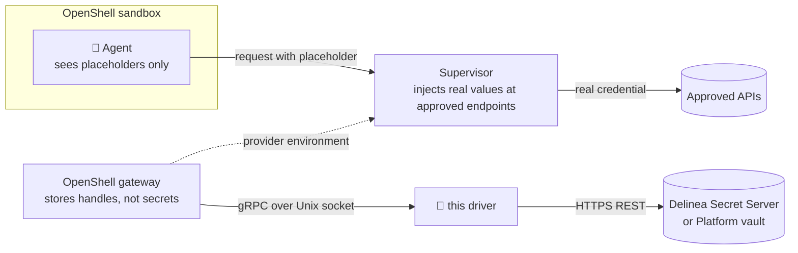

<div align="center">

# 🔐 openshell-secret-server-driver

**Your agents' credentials live in Delinea Secret Server.<br/>OpenShell hands them out only where policy says so.**

A credential driver that plugs [Delinea Secret Server](https://delinea.com/products/secret-server)
(and the vault behind a [Delinea Platform](https://delinea.com/products) tenant) into
[NVIDIA OpenShell](https://github.com/NVIDIA/OpenShell), the open-source runtime for sandboxed AI agents.


</div>

> [!NOTE]
> Built at **[Delinea](https://delinea.com)**. Released as an **unofficial, Delinea-sponsored**
> project. It isn't an official Delinea product and isn't covered by Delinea support.
> Not affiliated with or endorsed by NVIDIA.

---

## Why

OpenShell already keeps real secrets out of the agent: the sandbox sees a placeholder, and the
supervisor swaps in the real value only on requests to endpoints the policy approves. This driver
decides **where those secrets live**:

- 🏦 **One vault.** Agent credentials sit in Secret Server next to everything else you already govern.
- 🔎 **Every read is audited.** Each time the gateway resolves a credential, it shows up in the secret's audit trail.
- 🔄 **Rotation just works.** Rotate in Secret Server; the next resolve returns the new value with no OpenShell change.
- 🚫 **No secrets on disk.** The gateway keeps only opaque handles.

## How it works



| OpenShell call | What happens in Secret Server |
|---|---|
| `GetCapabilities` | Protocol negotiation (v1.0, `openshell.credentials.contract`). |
| `StoreCredential` | Creates one secret per credential in a dedicated folder, or updates it in place. |
| `ResolveCredentials` | Reads the secret, verifies it's the managed one for that exact provider and key, returns the value. |
| `DeleteCredential` | Deactivates the secret (soft delete, stays in the audit trail). |
| `ListCredentials` | Returns `UNIMPLEMENTED`. It's optional, and the OpenShell gateway doesn't call it (v0.1.2). |

## ✨ Features

- **Delinea Platform sign-in** with a service account (client credentials), plus Secret Server
  application accounts and static bearer tokens.
- **Replay-proof handles.** A handle is `v1:<secret id>`, and every read re-checks a name derived from
  workspace, provider, key and write ID. A stolen handle can't unlock another provider's secret or
  anything outside the managed folder.
- **Refresh-safe writes.** Staged refresh writes get their own secret; retries reuse the managed one.
- **Self-configuring.** Discovers the Platform's vault URL and a valid Secret Server site when you don't set them.
- **Gateway-managed lifecycle.** The gateway can launch and supervise the driver (`command` +
  `--bind-socket`), or connect to one you run yourself.

## 🚀 Quickstart

Needs [uv](https://docs.astral.sh/uv/). It fetches a suitable Python (3.11+) for you.

Try it without cloning:

```bash
uvx --from git+https://github.com/D1skin/openshell-secret-server-driver openshell-secret-server-driver --help
```

Develop and test:

```bash
git clone https://github.com/D1skin/openshell-secret-server-driver.git
cd openshell-secret-server-driver
uv sync                           # locked dependencies from uv.lock
uv run python tests/e2e_test.py   # 31 checks against a mock Secret Server
```

For a gateway, install a pinned build as a tool rather than pointing the gateway at `uvx`: the
gateway gives the driver a few seconds to start, and a cold `uvx` run may be downloading packages.

```bash
uv tool install git+https://github.com/D1skin/openshell-secret-server-driver@<tag-or-commit>
```

Point the gateway at the installed executable (`examples/gateway.toml`):

```toml
[openshell]
version = 2

[openshell.gateway]
credential_drivers = ["delinea-secret-server"]

[openshell.credential_drivers.delinea-secret-server]
transport = "uds"
socket_path = "/var/run/openshell/credential-drivers/delinea-secret-server.sock"
# Absolute path of the executable that `uv tool install` placed on your PATH.
command = "/opt/openshell/bin/openshell-secret-server-driver"
args = ["--config", "/etc/openshell/delinea-secret-server.json"]
startup_timeout_secs = 20
```

Then configure the driver (`examples/driver-config.json`) and prepare Secret Server:

1. Create a folder for OpenShell-managed secrets and give the driver's account **Owner** on it.
2. Pick a template with a password-type field (slug `password` by default).
3. Keep checkout, approval and comment requirements off that folder, since the gateway resolves unattended.

## 🎬 Demo

[`demo/`](demo/) replays a real user story end to end: Claude Code triages refunds inside an
OpenShell sandbox using an Orders API key that lives in Secret Server. It covers rotation, audit,
a prompt-injected agent with nothing to steal, and a kill switch.

## ⚙️ Configuration

Every setting can come from the JSON config or an environment variable.

| Setting | Env var | Notes |
|---|---|---|
| `base_url` | `SS_BASE_URL` | Secret Server URL. `https://` required (loopback may use `http://`). |
| `folder_id` | `SS_FOLDER_ID` | Folder that holds managed secrets. |
| `template_id` | `SS_TEMPLATE_ID` | Template used for new secrets. |
| `field_slug` | `SS_FIELD_SLUG` | Field that holds the value. Default `password`. |
| `site_id` | `SS_SITE_ID` | Optional. Discovered when unset. |
| `platform_hostname` | `SS_PLATFORM_HOSTNAME` | Delinea Platform tenant, for service-account sign-in. |
| `client_id` / `client_secret_file` | `SS_CLIENT_ID` / `SS_CLIENT_SECRET_FILE` | Platform service account. |
| `username` / `password_file` | `SS_USERNAME` / `SS_PASSWORD_FILE` | Secret Server application account. |
| `bearer_token_file` | `SS_BEARER_TOKEN_FILE` | Static token, no renewal. |
| `ca_bundle` | `SS_CA_BUNDLE` | Extra CA certificates for private PKI. |

## 🧪 Tests

| Suite | Runs against | What it proves |
|---|---|---|
| `uv run python tests/e2e_test.py` | Mock Secret Server | The full contract: negotiation, store, batch resolve, update, retry, refresh, rotation, replay and forged-handle refusal, session expiry, delete, audit trail, both sign-in modes, log hygiene. |
| `./live-test.sh --env-file <file>` | A real Delinea Platform tenant | The same lifecycle against the real vault. Runs the mock suite first and loads only the Platform env file you pass. |

**Wet test with a real OpenShell v0.1.2 gateway and Docker sandbox**, with the driver installed via `uv tool install` and a mock Secret Server backend:

| Step | Result |
|---|---|
| Gateway launches the driver and negotiates | `delinea-secret-server (credential-driver)`, protocol 1.0 |
| `openshell provider create` | Value stored through the driver; the gateway database holds no copy |
| Sandbox start | Gateway resolves the credential through the driver (audited as a read) |
| Agent inside the sandbox | Sees only `openshell:resolve:env:…` placeholders |
| Request to the approved endpoint | Arrives with the real value, injected by the supervisor |
| Rotate in Secret Server, start a new sandbox | New sandbox gets the rotated value, no OpenShell change |
| `openshell provider delete` | Secret deactivated in Secret Server |

The live test only touches what it creates: an `openshell-itest-<timestamp>` folder (inside a
folder the account owns if the root is off limits) filled with random test values. Everything is
removed in `finally`, and leftovers from a crashed run are swept at the start of the next one.
Results are reported as passed, failed and not run, never "green" by omission.

## 🔒 Security model

- TLS verification is always on. Private CAs go in `ca_bundle`; there is no bypass switch.
- The socket is owner-only (`0600`) in an owner-only directory. The driver refuses to replace
  symlinks, non-sockets, or sockets owned by someone else.
- Secret values and tokens never reach logs or error messages. The test suites check this.
- Resolved values do still pass through the gateway and the sandbox supervisor's memory; that's
  OpenShell's design. Secret Server holds them at rest and audits every read.

## 🗺️ Roadmap

- [ ] Parallel batch resolves
- [ ] `ListCredentials`, once OpenShell uses it
- [ ] Go or Rust port for production footprint

## 🤝 Contributing

Issues and pull requests are welcome. Please keep credentials, tenant names and local paths out
of commits, logs and issues; the `.gitignore` blocks common env and credential files.

## ⚖️ License

Released under the [MIT License](LICENSE). The vendored OpenShell protocol files in `proto/`
are © NVIDIA and remain under the Apache License 2.0 (see `proto/LICENSE`).

---

<div align="center">
<sub>Built at Delinea · Unofficial and Delinea-sponsored · MIT licensed · Made for the OpenShell community</sub>
</div>
